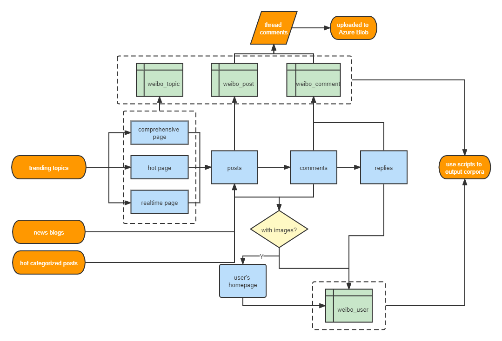

### A distributed crawler and data processing pipeline

Software Engineer Intern, Xiaobing.ai

*Jul 2021 - Oct 2021*

[Weibo](https://weibo.com/) is the second largest social media in China, providing abundant corpora and images for NLP and multimodal projects.

There are mainly three parts in this project:

- Weibo Crawler: Designed and implemented a distributed crawler from scratch to extract the information of trending topics, posts, comments, and user information, which can collect more than 300K records every day
- Data Pipeline: Cleaned, filtered, de-duplicated the scraped data by writing scripts, which is then stored in MongoDB
- Comment Threading: Threaded comments based on the time and contents, used the Depth-First search algorithm to
  create separate conversations and output a text over 30MB every day

