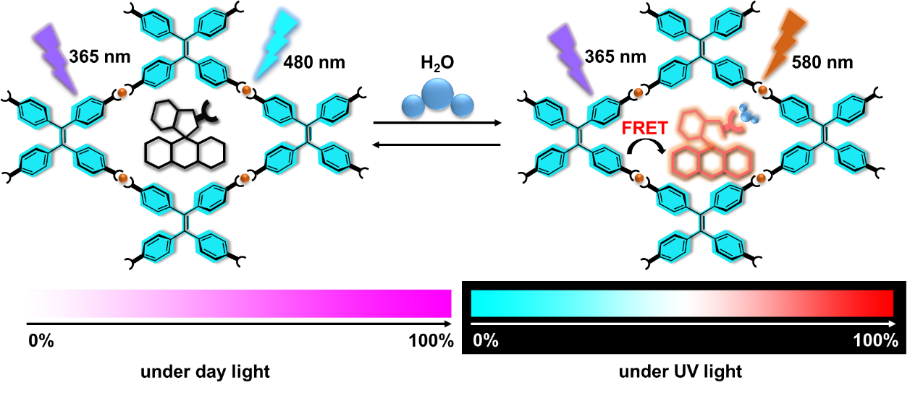
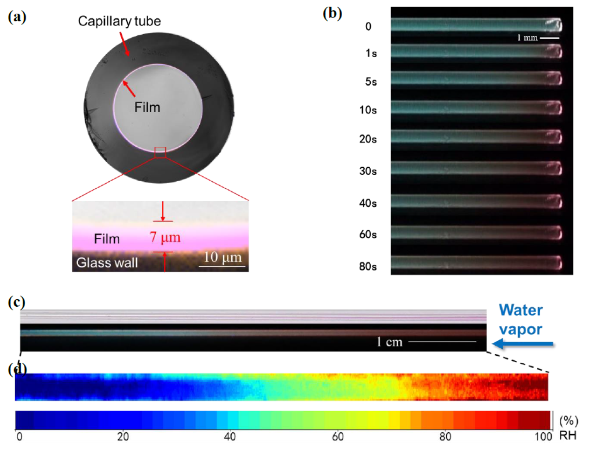

### A humidity-sensitive supramoleculr film based on the isomerizatino of Rodanmine B

Undergraduate Thesis, Peking University

*Dec 2017 - Jul 2018*

#### description

Humidity sensing plays paramount roles in fields ranging across daily life and national defense, yet advanced humidity sensors with multiple configuration compatibility to meet different applications still remain challenging. Combining the moisture-dependent isomerization of Rhodamine B (RhB) and a caking facilitated supramolecular film based on aggregation induced emission (AIE) chromophore, this study produced a humidity sensitive film which can respond both in color and fluorescence as a result of humidity sensitive fluorescence resonance energy transfer (FRET) between the AIEgen and RhB. 

<strong>mechanism of humidity sensitivity</strong>

The film shows excellent performance in terms of fast response, good reversibility, broad emission variation panel (120 nm), multiscale humidity sensing, high spatial-temporal resolution, and compatibility of multiple configurations. These talents allows the film to be used in a number of smart humidity sensing relevant devices, including humidity responsive UV-LED, advanced humidity sensors, automatic fog warning materials, and rewritable paper using water as ink. This for the first time achieves such a humidity sensing that are compatible with so many configurations.  We expect the present humidity visualization strategy may provide a new insight to develop humidity sensors for various applications.

<strong>the film can respond humidity changes both in color and fluorescence</strong>
