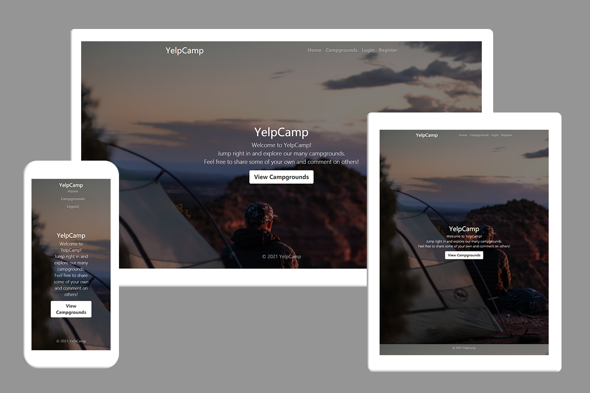
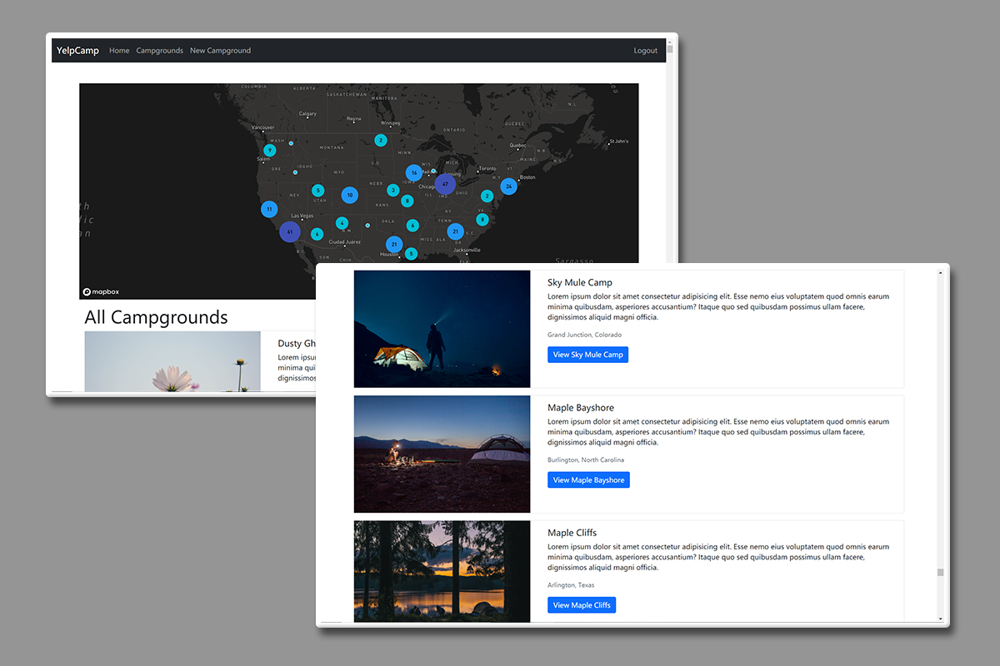
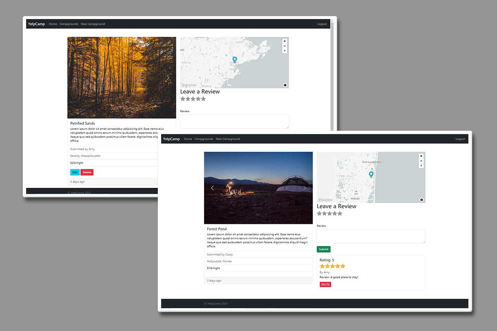
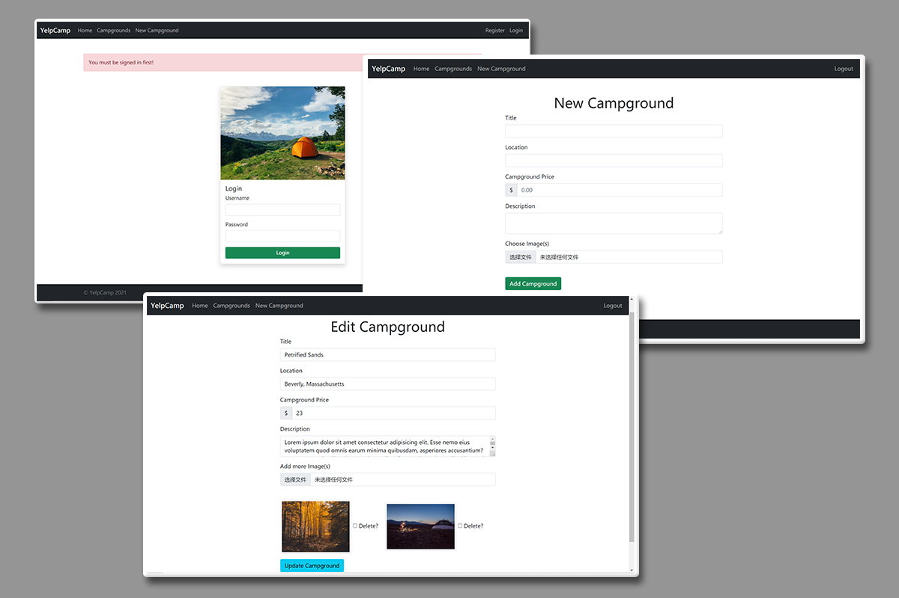

### A campground sharing and reviewing site - YelpCamp

Personal Project

*Mar 2021 - Jun 2021*

[Yelpcamp](https://stark-stream-80494.herokuapp.com/) is a Yelp style website for campgrounds, where people can share campsites with photos and comment on others. This app supports user authentication, posts management (creating, editing, and deleting), image uploading, and responsive design, etc.

- Front End: Built the framework of the website with HTML and implemented the responsive design with Bootstrap
- Back End: Built the database by using MongoDB Atlas as the cloud database for the data of campgrounds, comments, and users and Cloudinary as image hosting service, then deployed the website in Heroku; implemented user authentication with npm tools and stored user information in sessions

#### Features

Responsive design, using Bootstrap5

Index page of campgrounds with a ClusterMap

Campground details and its reviews

Making new campground and editing previous posts (authentication required)
