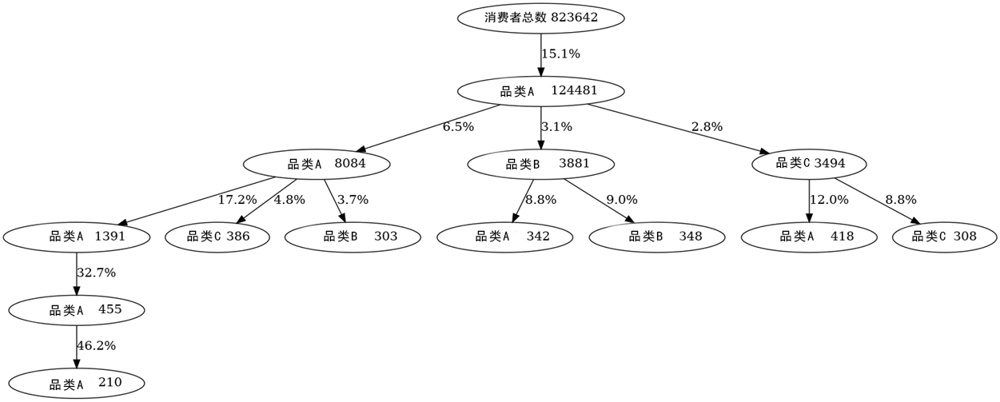

### Data mining and report automation for McCormick’s digital orders

Data Analyst Intern, Yimian Data

*Aug 2020 - Jan 2021*

Wrote python scripts to analyze McCormick's digital orders and generate a monthly report automatically. The analyzing process includes six parts: data cleaning, order patterns, repurchasing patterns, association analysis, repurchasing tree, user portraits.

- Data Cleaning: Cleaned over one million orders, extracted features, and matched items with changing titles, achieving a matching ratio of 99.6%
- Order patterns: Analyzed order patterns in the dimension of time, membership, order number, ptomotion, and discovered actionable insights
- repurchasing patterns: Caculated each item's repurchase cycle and repurchase rate to reach customers regularly
- Association Analysis: Used Association Analysis Model to caculate the support, confidence and lift with items, then found highly correlated items to sell and recommend to customers
- Repurchasing tree: Used Graphviz to draw customers’ repurchasing trees (what they buy first and if they repurchase, what is it) by using the data structure of the multi-way tree and the strategy of pruning
- User portraits: Analyzed users in the dimension of RFM (Recency/Frequency/Money) and regions

repurchasing tree
